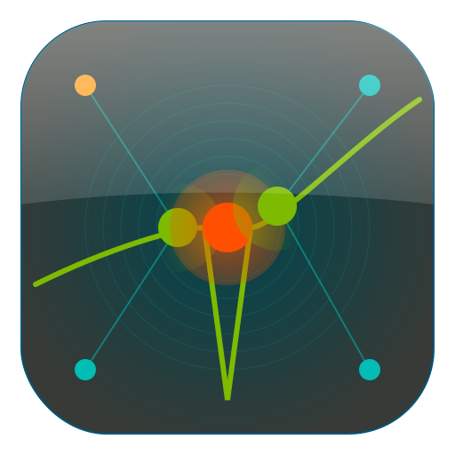

# Orion Studio: Brand Iconography & Rationale

  

## The Core Concept: "Macro Scale, Micro Physics"

The Orion Studio identity is built on a visual parallel between the **celestial scale** of the Orion constellation and the **atomic scale** of neutron imaging. Just as the constellation guides the hunter in the night sky, the software guides the scientist through the "darkness" of the material to reveal the internal structure of matter.

The icon serves not just as a logo, but as a diagram of the neutron imaging process itself.

## Visual Decomposition

### 1. The Belt as the Instrument (The Triad)

The three most prominent stars (Orion's Belt) are aligned linearly, mirroring the fundamental geometry of a neutron beamline instrument:

- **The Left Star (Source):** Represents the neutron generation (reactor or spallation).
- **The Center Star (Sample):** The focal point of the software. This is the largest element, glowing in *Spark Orange*, representing the interaction event where neutrons collide with the material.
- **The Right Star (Detector):** Represents the capture of data and the resulting image.

### 2. The Beam & The Resonance Dip

Traversing the stars is a high-energy path (in *Energy Green*) representing the neutron flux.

- **The Feature:** Crucially, the beam dives into a sharp "V" shape directly over the central star.
- **The Meaning:** This is not a random curve; it visualizes a **Resonance Absorption Dip**. It represents the precise moment specific energy neutrons are absorbed by atomic nuclei. It signals that Orion Studio is not just for viewing images, but for analyzing the quantitative spectroscopic data hidden within them.

### 3. The Constellation Network

Faint geometric lines (*Aqua*) connect the outer stars to the central belt.

- **The Meaning:** This symbolizes connectivity. It represents Orion Studio as the central hub that connects the disparate beamlines (MARS, VENUS, CUPID) and integrates various data streams into a unified "constellation" of results.

### 4. The Vacuum Environment

The background gradient (*Hale Navy* to *Dark Matter*) simulates two environments simultaneously:

- **Deep Space:** The home of the constellation.
- **The Vacuum Chamber:** The interference-free environment required for high-precision neutron science.

## Color System Application

The palette is strictly derived from the ORNL identity system to ensure institutional cohesion, but applied with functional intent:

| Color | Hex | Usage |
|-------|-----|-------|
| Hale Navy | `#00454D` | Primary background - establishes scientific context |
| Dark Matter | `#373A36` | Background gradient terminus |
| Energy Green | `#7DBA00` | Data stream - represents the "live" neutron beam |
| Spark Orange | `#FE5000` | Interaction point - highlights area of active discovery |
| Aqua | `#00BDB5` | Structure - represents supporting framework and cold neutrons |
| Forge Orange | `#FF9E1B` | Corner accent nodes |

### ORNL Color Palette Reference

**Primary Colors:**

- ORNL Green: `#00662C`
- Hale Navy: `#00454D`
- Graphite: `#DBDCDB`
- Polar: `#FFFFFF`
- Dark Matter: `#373A36`

**Secondary Colors:**

- Energy: `#7DBA00`
- Mist: `#8BFEBF`
- Biome: `#00B38F`
- Aqua: `#00BDB5`
- Infinity: `#006BA6`
- Hydro: `#005776`

**Accent Colors (max 25% usage):**

- Forge: `#FF9E1B`
- Spark: `#FE5000`
- Plasma: `#B50094`
- Pulsar: `#4E008E`

## Summary

The Orion Studio mark transforms the static "O" of a name into a dynamic **event**. It captures the exact millisecond where a neutron beam reveals the atomic secrets of a sample, framed by the mythological hunter that gives the platform its name.

## Technical Notes

- **Source file:** `resources/icons/orion-icon.svg` (512x512 vector)
- **Build process:** Icons are generated automatically from SVG during build
  - macOS: Converted to `.icns` via `iconutil`
  - Linux: Converted to multiple PNG sizes for `.desktop` integration
