# Orion Studio User Guide

A comprehensive guide for instrument scientists using Orion Studio at ORNL's MARS (HFIR) and VENUS (SNS) beamlines.

---

## Table of Contents

1. [Introduction](#introduction)
2. [Installation](#installation)
3. [First Launch](#first-launch)
4. [Working Locally](#working-locally)
5. [Connecting to Analysis Clusters](#connecting-to-analysis-clusters)
6. [Using Jupyter Notebooks](#using-jupyter-notebooks)
7. [Git Version Control](#git-version-control)
8. [GitHub Copilot](#github-copilot)
9. [Troubleshooting](#troubleshooting)
10. [FAQ](#faq)

---

## Introduction

### What is Orion Studio?

Orion Studio is a specialized desktop application built for neutron imaging data analysis at ORNL. It provides a complete environment for working with Jupyter notebooks, Python scripts, and data analysis workflows.

### Why Use Orion Studio Instead of JupyterLab?

| Feature | Orion Studio | Browser JupyterLab |
|---------|--------------|-------------------|
| Native desktop app | Yes | No (browser-based) |
| Integrated Git version control | Yes | Limited |
| Code autocomplete (IntelliSense) | Full IDE support | Basic |
| AI-assisted coding (Copilot) | Built-in | Not available |
| Remote SSH connection | Seamless | Requires separate setup |
| Python environment management | Automatic (Pixi) | Manual |

### Pre-installed Tools

Orion Studio comes with everything you need already installed:

- **Jupyter** - Native notebook support with all cell types
- **Python** - Full language support with IntelliSense
- **Remote SSH** - Connect to analysis clusters
- **GitHub Copilot** - AI code assistant (optional)
- **Git** - Version control for your notebooks

---

## Installation

### Download

Go to the **GitHub Releases** page to download the latest version:

**https://github.com/ornlneutronimaging/orion/releases**

Download the appropriate file for your operating system:

- **macOS**: `OrionStudio-macOS.dmg`
- **Linux**: `OrionStudio-linux-x64.tar.gz`

### macOS

1. Download `OrionStudio-macOS.dmg` from the [releases page](https://github.com/ornlneutronimaging/orion/releases)
2. Open the DMG file
3. Drag **Orion Studio** to your **Applications** folder
4. Launch from Applications or Spotlight search

<!-- Screenshot: DMG installer window with drag-to-Applications instruction -->
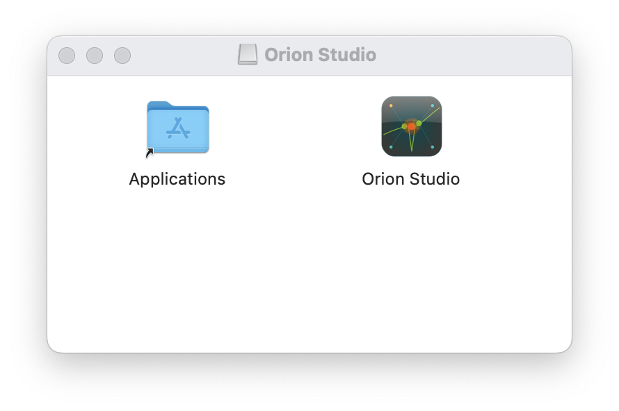

### Linux

1. Download `OrionStudio-linux-x64.tar.gz` from the [releases page](https://github.com/ornlneutronimaging/orion/releases)
2. Extract the archive:

   ```bash
   tar -xzf OrionStudio-linux-x64.tar.gz
   ```

3. Run the application:

   ```bash
   ./OrionStudio/OrionStudio
   ```

### System Requirements

- **macOS**: 10.15 (Catalina) or later, Apple Silicon or Intel
- **Linux**: Ubuntu 20.04+ or equivalent, x64 or ARM64
- **Network**: ORNL network access required for remote cluster connections

---

## First Launch

When you launch Orion Studio for the first time, you'll see the **Welcome Wizard** that helps you set up your working environment.

### Step 1: Choose Your Working Mode

<!-- Screenshot: Welcome screen with two buttons -->
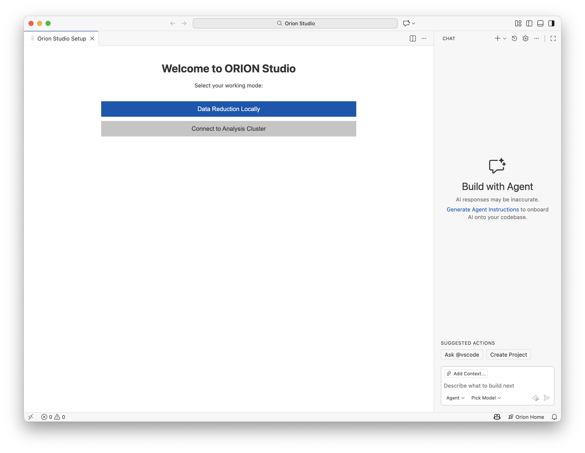

You have two options:

| Option | When to Use |
|--------|-------------|
| **Data Reduction Locally** | Working on your laptop/desktop with local files |
| **Connect to Analysis Cluster** | Working on ORNL remote servers with large datasets |

---

## Working Locally

Choose **"Data Reduction Locally"** if you want to:
- Work on your personal computer
- Analyze smaller datasets
- Work offline or outside ORNL network

### Setting Up a Local Workspace

After selecting local mode, you'll choose how to set up your project:

<!-- Screenshot: Workspace setup options -->
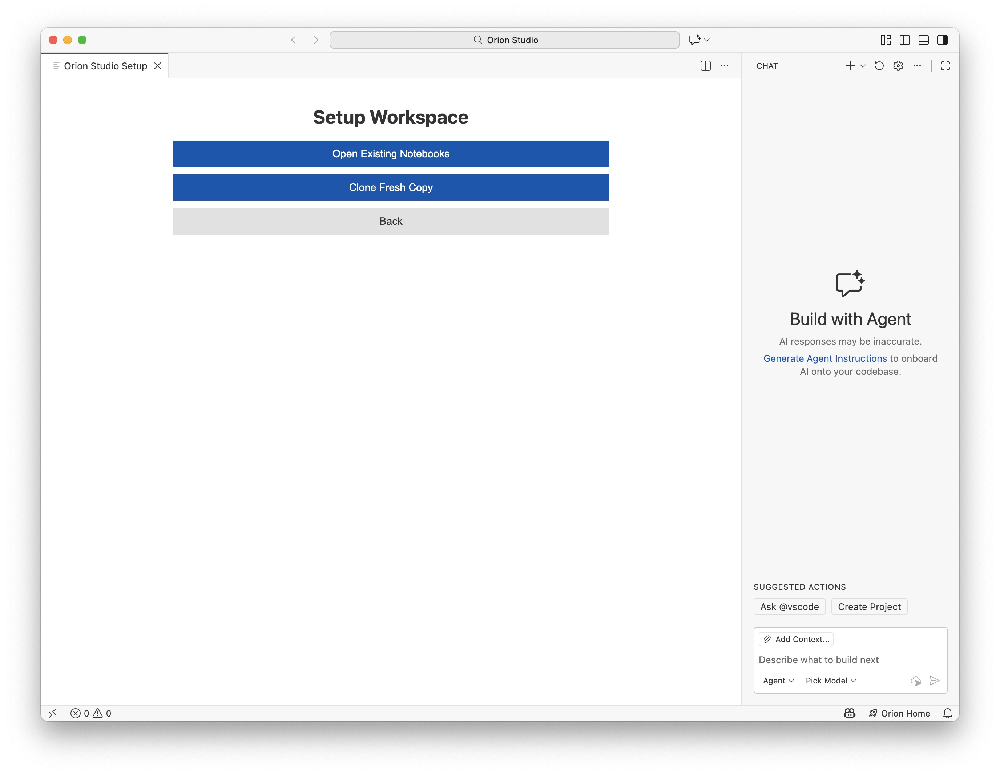

#### Option A: Open Existing Notebooks

Use this if you already have notebook files on your computer:

1. Click **"Open Existing Notebooks"**
2. Click **Browse** and select your project folder
3. Click **"Start Orion Studio"**

#### Option B: Clone Fresh Copy

Use this to download the standard neutron imaging notebooks:

1. Click **"Clone Fresh Copy"**
2. Click **Browse** and select a parent folder (e.g., `Documents`)
3. A `neutron_notebooks` subfolder will be created automatically
4. Enter a branch name or keep the default (e.g., `analysis-20241202`)
5. Click **"Start Orion Studio"**

<!-- Screenshot: Configuration screen with folder picker and branch name -->
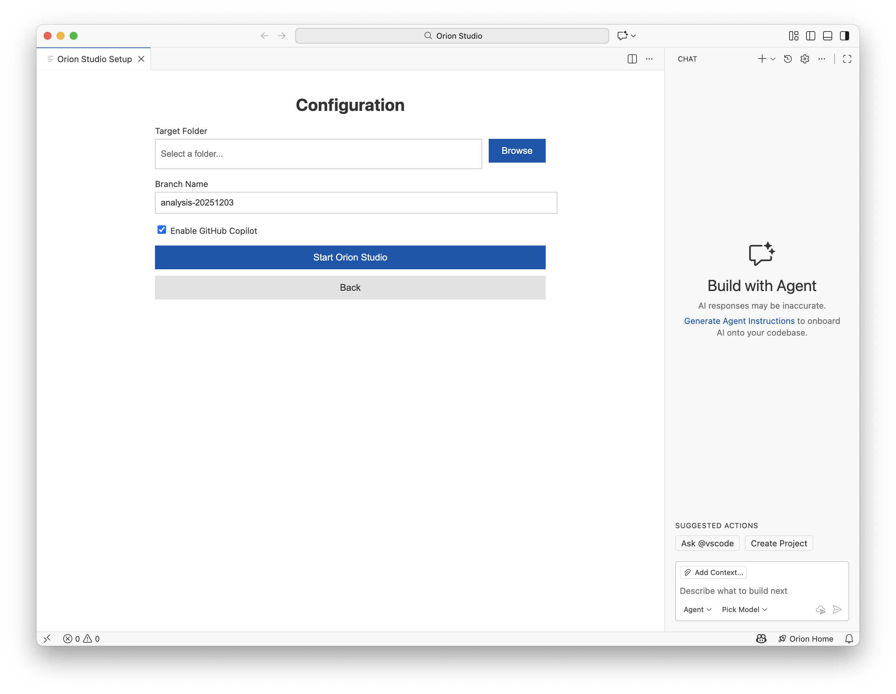

### What Happens During Setup

When you click "Start Orion Studio", the application:

1. Clones the repository (if selected)
2. Creates your analysis branch
3. Installs the Python environment using Pixi
4. Opens your workspace

A progress notification will appear in the bottom-right corner.

<!-- Screenshot: Progress notification -->
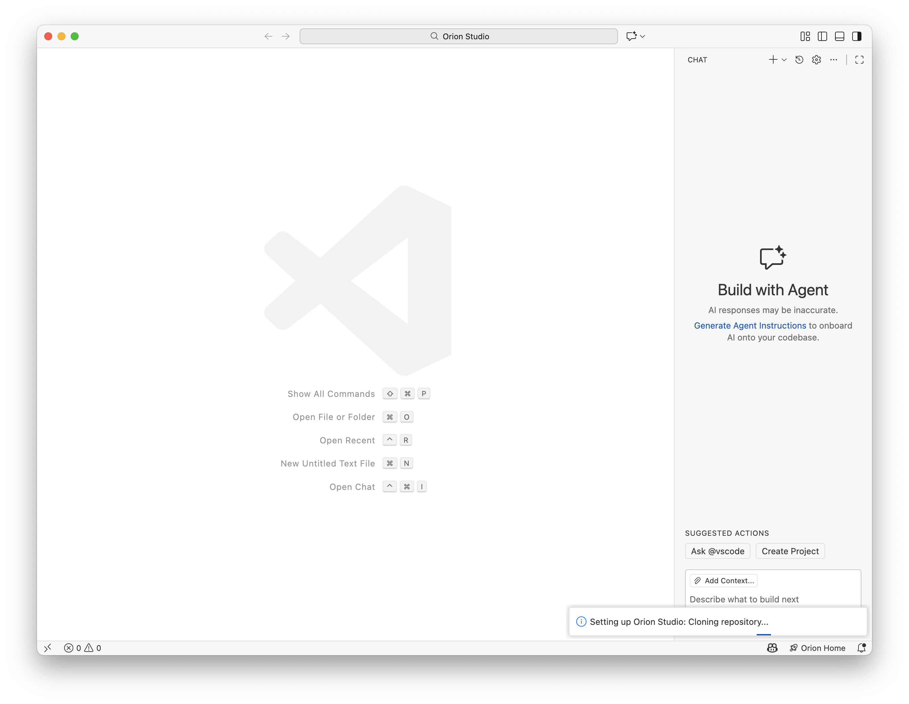

---

## Connecting to Analysis Clusters

Choose **"Connect to Analysis Cluster"** when you need to:

- Process large datasets on ORNL servers
- Access beamline data directly
- Use high-performance computing resources

### Step 1: Select a Host

<!-- Screenshot: Host selection screen -->
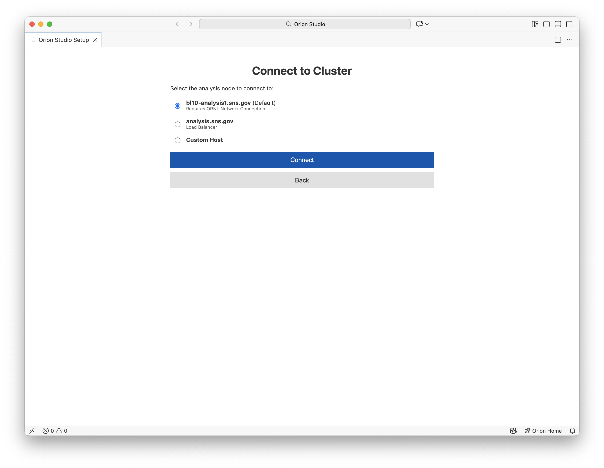

| Host | Description | Network Requirement |
|------|-------------|---------------------|
| `bl10-analysis1.sns.gov` | Dedicated BL10 analysis node | ORNL internal network |
| `analysis.sns.gov` | SNS load balancer (auto-selects node) | ORNL network or VPN |
| Custom | Enter any SSH hostname | Varies |

Select your host and click **Connect**.

### Step 2: Authenticate

A terminal window will appear prompting for your credentials:

<!-- Screenshot: SSH authentication terminal -->
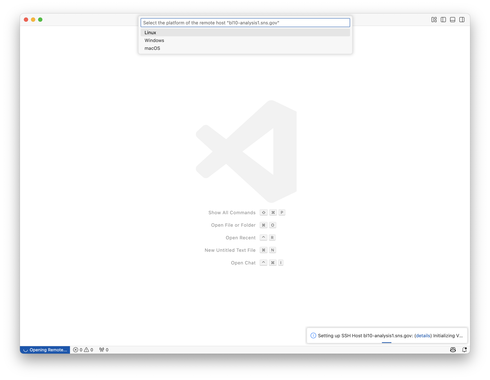

1. Enter your **UCAMS/XCAMS username** when prompted
2. Enter your **password**
3. Complete **two-factor authentication** if required

Once connected, you'll see a "Connected to Remote Environment" indicator.

> If you see a request for installing the SSH remote extension, proceed to install it and the application will auto reload.

### Step 3: Set Up Remote Workspace

After connecting, the wizard continues on the remote server:

1. Choose **"Open Existing Notebooks"** or **"Clone Fresh Copy"**
2. Enter the target folder path (e.g., `/SNS/users/your-username/notebooks`)
3. Click **"Start Orion Studio"**

The setup commands will run in a terminal on the remote server.

### Remote Setup Terminal

When setting up on a remote server, you'll see commands executing in a terminal:

<!-- Screenshot: Remote setup terminal -->
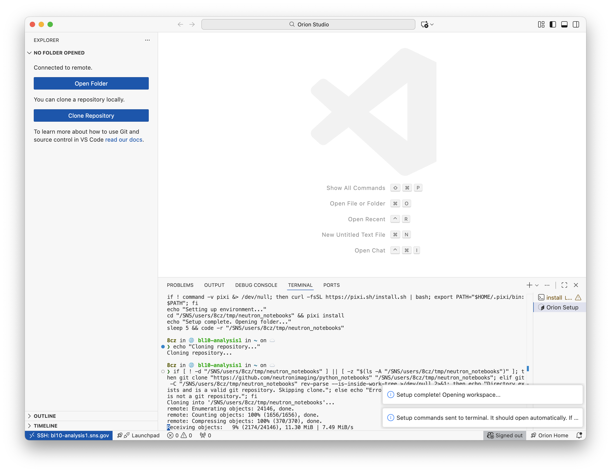

```
Cloning repository...
Checking for Pixi...
Setting up environment...
Setup complete. Opening folder...
```

Wait for the folder to open automatically. If it doesn't, you can run `code -r .` in the terminal.

---

## Using Jupyter Notebooks

### Opening Notebooks

1. Press `Cmd + Shift + E` (macOS) or `Ctrl + Shift + E` (Linux) to open the Explorer panel
2. Browse and click any `.ipynb` file to open it
3. The notebook renders with all cells and outputs

<!-- Screenshot: Notebook open in Orion Studio -->
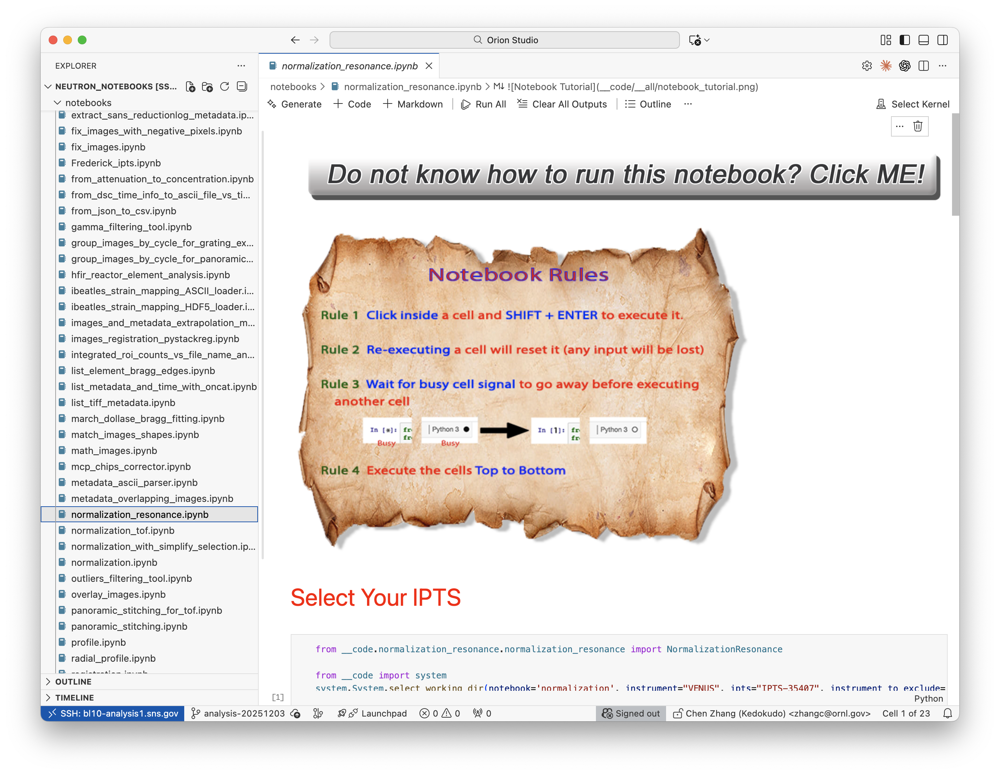

### Running Cells

| Action | Shortcut | Button |
|--------|----------|--------|
| Run current cell | `Shift + Enter` | Play button (▶) |
| Run cell, stay in place | `Ctrl + Enter` | - |
| Run all cells | - | "Run All" button |
| Interrupt kernel | - | Stop button (⬛) |
| Restart kernel | - | Restart button (↻) |

### Selecting a Kernel

When you first open a notebook, you may need to select a Python kernel:

1. Click **"Select Kernel"** in the top-right of the notebook
2. Choose **"Python Environments"**
3. Select the Pixi environment (usually marked with `pixi`)

<!-- Screenshot: Kernel selection dropdown -->
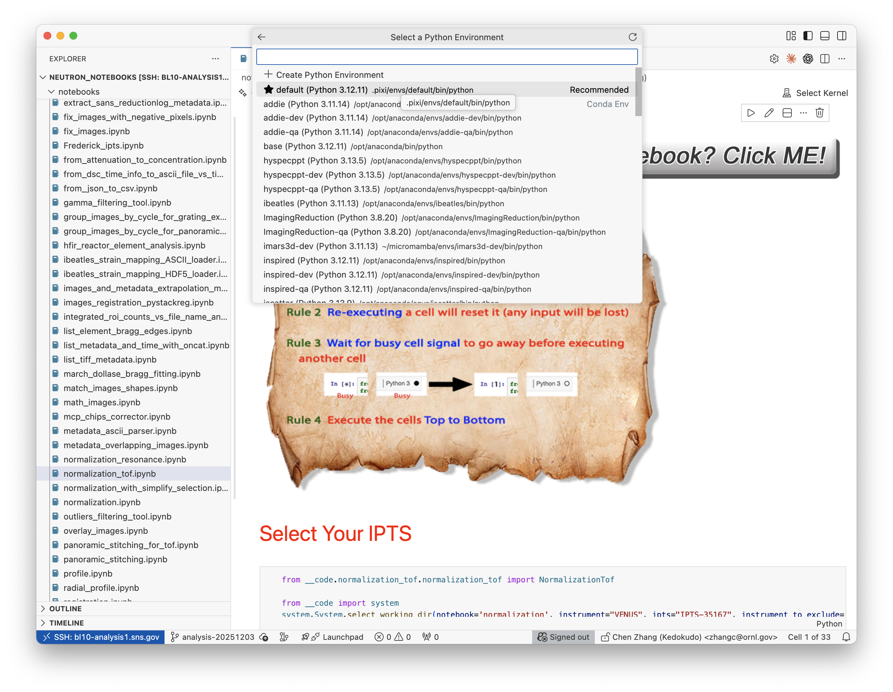

### Cell Types

- **Code cells**: Write and execute Python code
- **Markdown cells**: Write documentation with formatting
- **Raw cells**: Plain text without execution

To change cell type, use the dropdown at the bottom of the cell or press:

- `M` - Convert to Markdown
- `Y` - Convert to Code

### IntelliSense (Code Completion)

As you type, Orion Studio suggests completions:

<!-- Screenshot: IntelliSense popup -->
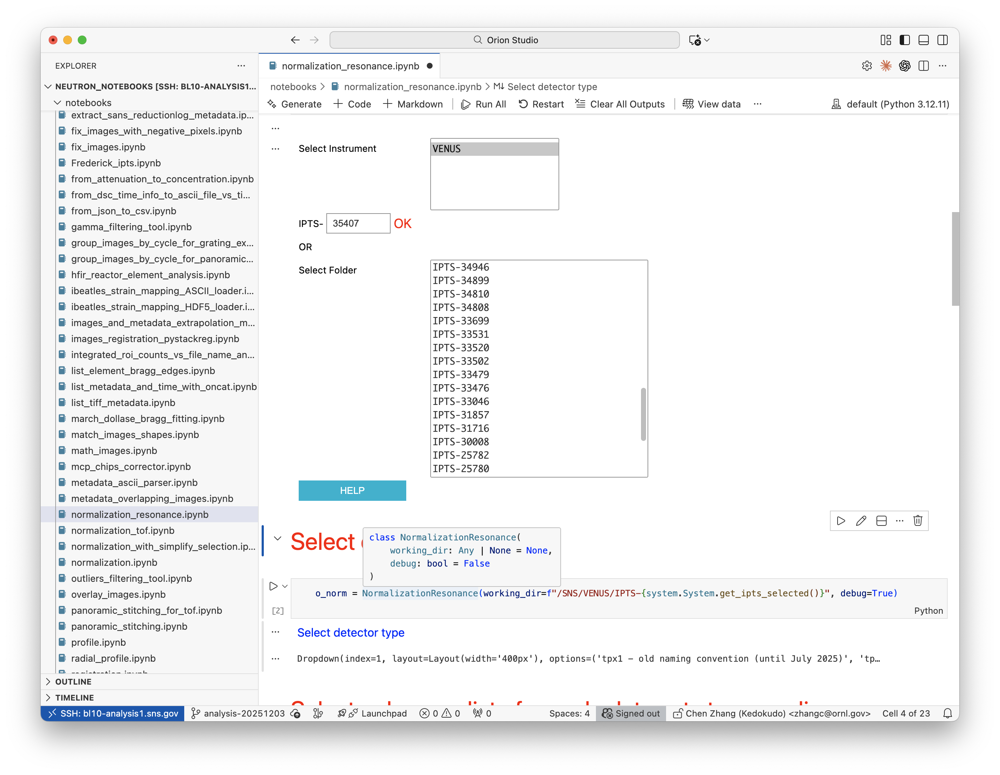

- Press `Tab` or `Enter` to accept a suggestion
- Press `Escape` to dismiss
- Press `Ctrl + Space` to manually trigger suggestions

---

## Git Version Control

Orion Studio includes Git support for version controlling your notebooks.

### Initial Setup

When you use the **"Clone Fresh Copy"** option during setup, Orion Studio automatically:

1. Clones the notebook repository to your machine
2. Creates a new branch for your analysis (e.g., `analysis-20241203`)

After this initial setup, you are responsible for managing your changes (staging, committing, pushing).

### Using Git via Command Palette

Access Git commands through the **Command Palette**:

1. Press `Cmd + Shift + P` (macOS) or `Ctrl + Shift + P` (Linux)
2. Type "Git" to see available commands

| Command | Description |
|---------|-------------|
| `Git: Stage All Changes` | Stage all modified files |
| `Git: Commit` | Commit staged changes |
| `Git: Push` | Push commits to remote |
| `Git: Pull` | Pull latest changes |
| `Git: Checkout to...` | Switch branches |

<!-- Screenshot: Command Palette with Git commands -->
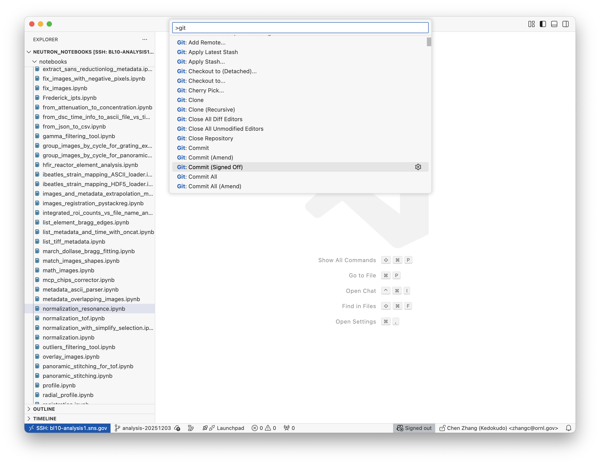

### Current Branch

The current branch name is displayed in the bottom-left of the status bar. Click it to switch branches or create a new one.

---

## GitHub Copilot

GitHub Copilot is an AI assistant that helps you write code faster.

### Enabling/Disabling Copilot

During setup, you can enable or disable Copilot with the checkbox:

<!-- Screenshot: Copilot checkbox in wizard -->
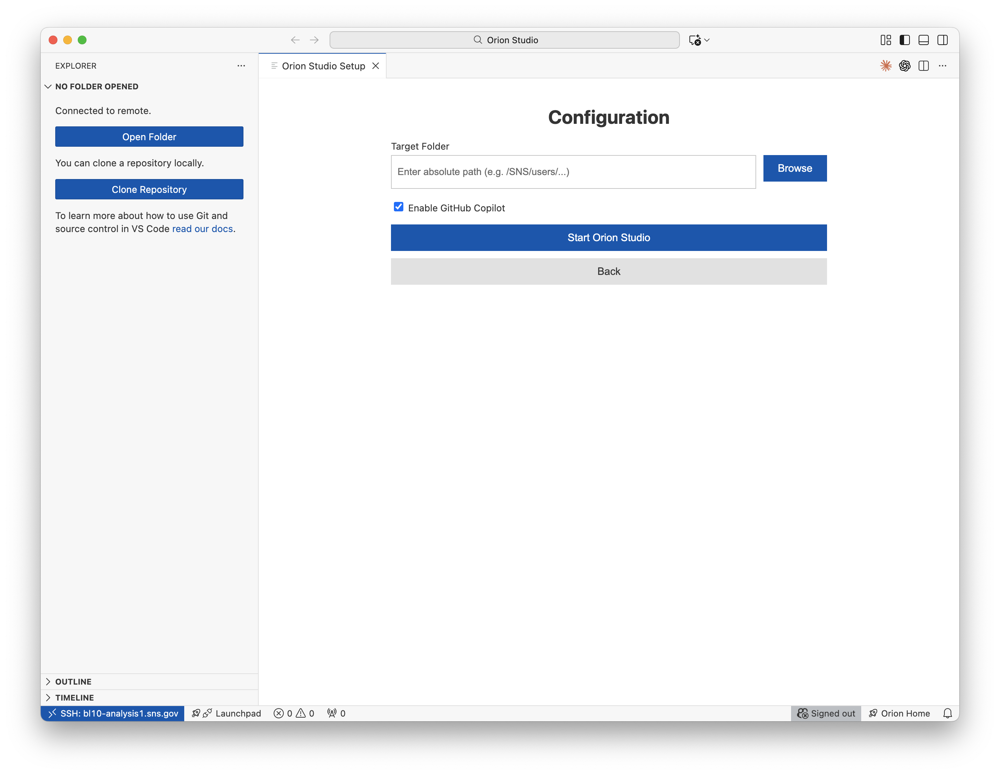

### Using Copilot in Notebooks

When enabled, Copilot provides:

1. **Inline suggestions** - Ghost text appears as you type
   - Press `Tab` to accept
   - Press `Escape` to dismiss

2. **Chat** - Ask questions about your code
   - Press `Ctrl + I` to open inline chat
   - Type your question and press Enter

### Copilot Tips for Data Analysis

Try prompts like:

- "Load the TIFF files from this directory"
- "Plot this data as a histogram"
- "Calculate the mean and standard deviation"
- "Write a function to normalize this image"

---

## Troubleshooting

### Connection Issues

#### "Connection refused" when connecting to remote

**Cause**: Not on ORNL network or VPN not connected

**Solution**:

1. Ensure you're connected to ORNL network or VPN
2. Try `analysis.sns.gov` instead of specific nodes
3. Verify you can SSH from a regular terminal first

#### SSH keeps asking for password

**Cause**: SSH keys not configured

**Solution**: Set up SSH key authentication:

```bash
# On your local machine
ssh-keygen -t ed25519
ssh-copy-id username@analysis.sns.gov
```

### Notebook Issues

#### "No kernel found" error

**Cause**: Python environment not properly set up

**Solution**:

1. Open a terminal in Orion (`Terminal > New Terminal`)
2. Run `pixi install` in your project folder
3. Restart Orion Studio
4. Select the Pixi kernel when prompted

#### Notebook cells won't run

**Cause**: Kernel disconnected or crashed

**Solution**:

1. Click the **Restart** button in the notebook toolbar
2. If that fails, try "Select Kernel" and choose a different kernel
3. Check for syntax errors in previous cells

### Git Issues

#### "fatal: not a git repository"

**Cause**: Current folder is not a Git repository

**Solution**:

1. Clone the repository again using the wizard
2. Or initialize Git: `git init` in the terminal

#### Cannot push changes

**Cause**: No permission or branch protection

**Solution**:

1. Ensure you're on your own branch (not `main`)
2. Check you have write access to the repository
3. Pull latest changes first: `git pull`

### Performance Issues

#### Orion Studio is slow on remote

**Cause**: Network latency or server load

**Solution**:

1. Try a different analysis node
2. Close unused tabs and notebooks
3. Restart the remote connection

---

## FAQ

### How do I return to the setup wizard?

Click the **"🚀 Orion Home"** button in the bottom status bar.

<!-- Screenshot: Status bar with Orion Home button -->


### Where are my settings stored?

Orion Studio stores configuration in `~/.orion-studio/config.json`. This includes your workspace path and preferences.

### Can I use my own VS Code extensions?

Yes! Use `View > Extensions` to browse and install additional extensions. Any extensions you install will be available in Orion Studio.

### How do I update Orion Studio?

Download the latest version from the [GitHub Releases page](https://github.com/ornlneutronimaging/orion/releases) and replace your current installation. Your settings and configurations will be preserved.

### Can I use Orion Studio with other repositories?

Yes. Use the wizard to open any folder, or use `File > Open Folder` to open any directory. The wizard's "Clone Fresh Copy" option specifically clones the standard neutron notebooks, but you can work with any project.

### What's the difference between local and remote mode?

| Aspect | Local | Remote |
|--------|-------|--------|
| Data location | Your computer | ORNL servers |
| Compute power | Your hardware | Server resources |
| Data transfer | Must copy files | Direct access |
| Network | Works offline | Requires connection |

### How do I report bugs or request features?

Open an issue at: https://github.com/ornlneutronimaging/orion/issues

---

## Quick Reference

### Keyboard Shortcuts

| Action | macOS | Linux/Windows |
|--------|-------|---------------|
| Run cell | `Shift + Enter` | `Shift + Enter` |
| Run cell, stay | `Ctrl + Enter` | `Ctrl + Enter` |
| Open command palette | `Cmd + Shift + P` | `Ctrl + Shift + P` |
| Open file | `Cmd + P` | `Ctrl + P` |
| Save | `Cmd + S` | `Ctrl + S` |
| Toggle sidebar | `Cmd + B` | `Ctrl + B` |
| New terminal | `Ctrl + `` ` | `Ctrl + `` ` |
| Copilot inline chat | `Cmd + I` | `Ctrl + I` |

### Status Bar Icons

| Icon | Meaning |
|------|---------|
| 🚀 Orion Home | Return to setup wizard |
| Branch name | Current Git branch (click to switch) |
| Python version | Current Python interpreter |
| Sync icon | Git sync status |

---

## Getting Help

- **Documentation**: This guide and other docs in the `docs/` folder
- **Issues**: https://github.com/ornlneutronimaging/orion/issues
- **ORNL Help Desk**: For network and account issues

---

*Last updated: December 2025*
